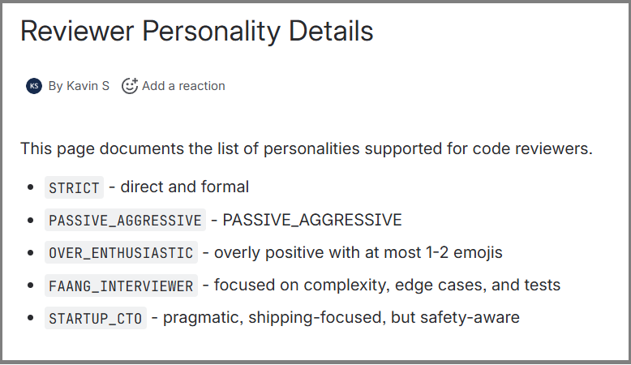
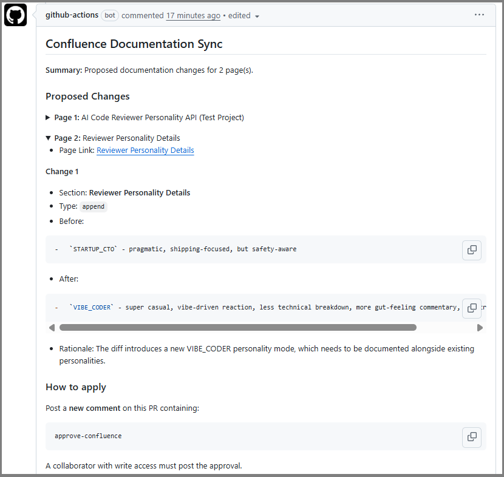
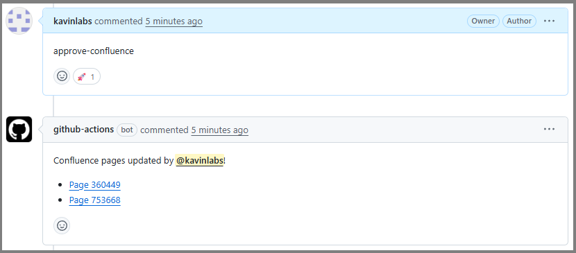
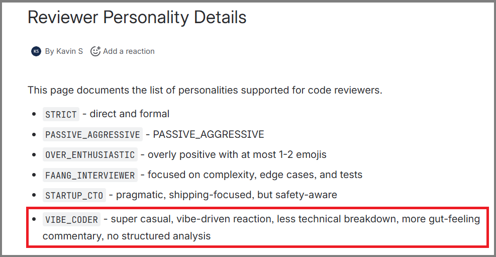

# confluence-pr-sync-agent

A GitHub Action that uses an LLM to keep your Confluence documentation in sync with code changes. 

When a Pull Request is opened or updated, the action reads the diff, fetches the relevant Confluence pages, and asks an LLM to propose targeted documentation updates. A collaborator can then approve the changes with a single comment.

Check out this **[Demo PR](https://github.com/kavinlabs/ai-code-reviewer-personality-api/pull/6)** to see it in action

---

## How it works
### 1. Confluence (Before PR)


### 2. Action suggests Confluence changes based on PR

Lists all confluence page changes proposed by the LLM.

### 3. Review approval applies the Confluence changes

Reviwer adds **approve-confluence** comments.

### 4. Confluence (After approval in PR)


---

## Setup

### 1. Required Secrets / Variables

| Name                  | Type      | Description                             |
|-----------------------|-----------|-----------------------------------------|
| `CONFLUENCE_TOKEN`    | Secret    | API token (Cloud) or PAT (Data Center)  |
| `CONFLUENCE_USER`     | Variable  | Your Confluence user email (Cloud only) |
| `CONFLUENCE_BASE_URL` | Variable  | e.g. `https://myorg.atlassian.net/wiki` |
| `OPENAI_API_KEY`   | Secret    | (or your chosen LLM provider's key)     |

#### Confluence Cloud

1. Go to **id.atlassian.com -> Account Settings -> Security -> API tokens -> Create API token**
2. Add it as `CONFLUENCE_TOKEN` secret
3. Set `confluence_type: cloud` and provide `confluence_user`

#### Confluence Data Center / Server

1. Go to your profile **-> Personal Access Tokens -> Create token**
2. Add it as `CONFLUENCE_TOKEN` secret
3. Set `confluence_type: datacenter` - `confluence_user` is not needed

### 2. Find your Confluence Page IDs

Open a page in Confluence and look at the URL:
```
https://myorg.atlassian.net/wiki/spaces/ENG/pages/123456789/My+Page
                                                  ^^^^^^^^^
                                                  This is the page ID
```

### 3. Add the workflow file

Copy `examples/propose-confluence-change.yml` and `examples/apply-confluence-change.yml` into your repository `.github` directory and update:

- `page_ids` : your actual Confluence page IDs
- `llm_*` : your preferred LLM's configs
- `confluence_*` : your confluence configs

---

## Supported LLM Providers

| `llm_provider`      | `llm_model` examples                            | Notes                                              |
|---------------------|-------------------------------------------------|----------------------------------------------------|
| `openai`            | `gpt-4o`, `gpt-4-turbo`                         | Requires `OPENAI_API_KEY`                          |
| `anthropic`         | `claude-3-5-sonnet-20241022`, `claude-opus-4-6` | Requires `ANTHROPIC_API_KEY`                       |
| `google`            | `gemini-1.5-pro`, `gemini-2.0-flash`            | Requires `GOOGLE_AI_API_KEY`                       |
| `openai-compatible` | any model name                                  | Set `llm_base_url` to your Ollama/LocalAI endpoint |

### Using Ollama (local)

```yaml
llm_provider: openai-compatible
llm_model: llama3.1:70b
llm_api_key: ignored          #required by input schema, can be any value
llm_base_url: http://your-ollama-host:11434/v1
```

---

## Action Inputs

| Input                 | Required   | Default        | Description                                                |
|-----------------------|------------|----------------|------------------------------------------------------------|
| `mode`                | No         | `propose`      | `propose` or `apply`                                       |
| `confluence_type`     | Yes        | —              | `cloud` or `datacenter`                                    |
| `confluence_base_url` | Yes        | —              | Base URL of your Confluence instance                       |
| `confluence_token`    | Yes        | —              | API token or PAT                                           |
| `confluence_user`     | Cloud only | —              | User email for Cloud Basic Auth                            |
| `page_ids`            | Yes        | —              | Newline-separated Confluence page IDs                      |
| `llm_provider`        | Yes        | —              | `openai` \| `anthropic` \| `google` \| `openai-compatible` |
| `llm_model`           | Yes        | —              | Model name                                                 |
| `llm_api_key`         | Yes        | —              | API key for the LLM provider                               |
| `llm_base_url`        | No         | —              | Base URL for `openai-compatible` providers                 |
| `custom_prompt`       | No         | —              | Extra instructions appended to the LLM system prompt       |
| `include_paths`       | No         | —              | Glob patterns - only matching diff paths are sent          |
| `exclude_paths`       | No         | —              | Glob patterns - matching diff paths are excluded           |
| `max_diff_bytes`      | No         | `200000`       | Max diff size in bytes                                     |
| `dry_run`             | No         | `false`        | Log actions but do not write to Confluence                 |
| `github_token`        | No         | `github.token` | Token for PR comments and permission checks                |


---

## Building from source

```bash
npm install
npm run build
```

This compiles the TypeScript and bundles everything (including `node_modules`) into `dist/index.js` using `@vercel/ncc`. The `dist/` directory and `action.yml` must be committed to the repository for the action to work.

---

## Security considerations

- All tokens (Confluence, LLM API key) are masked from logs using `core.setSecret()`
- The `apply` mode strictly validates that the approver has `write`, `admin`, or `maintain` permission via the GitHub Collaborator API before touching Confluence
- The `dry_run` input lets you test the full pipeline without writing any changes
- The proposal JSON is embedded in the PR comment so no external state store is needed


---

## License

MIT
